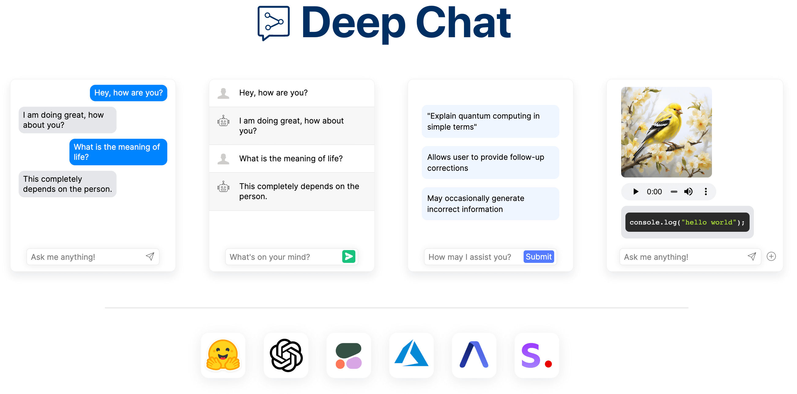

<br />



<b>Deep Chat</b> is a fully customizable AI chat component that can be injected into your website with minimal to no effort. Whether you want to create a chatbot that leverages popular APIs such as ChatGPT or connect to your own custom service, this component can do it all! Explore [deepchat.dev](https://deepchat.dev/) to view all of the available features, how to use them, examples and more!

### :rocket: Main Features

- Connect to any API
- Avatars
- Names
- Send/Receive files
- Capture photos via webcam
- Record audio via microphone
- Speech To Text for message input
- Text To Speech to hear message responses
- Support for MarkDown to help structure text and render code
- Introduction panel and dynamic modals to help describe functionality for your users
- Connect to popular AI APIs such as OpenAI, HuggingFace, Cohere directly from the browser
- Support for all major ui frameworks/libraries
- Everything is customizable!

### :tada: Latest update

<p align="center">
    
</p>

We are excited to release a new addition to the Deep Chat website - the Playground. Here you will be able to create, configure and use Deep Chat components without needing to write any code. Check it out in the official [Playground page](https://deepchat.dev/playground) to get started!

### :computer: Getting started

```
npm install deep-chat
```

If using React, install the following instead:

```
npm install deep-chat-react
```

To test the component - simply add the following to your markup:

```
<deep-chat directConnection='{"demo":true}'/>
```

The exact syntax for the above example will vary depending on the framework of your choice ([see here](https://deepchat.dev/examples/frameworks)).

### :zap: Connect


Connecting to a service is simple, all you need to do is define its API details using the [`request`](https://deepchat.dev/docs/connect#request) property:

```
<deep-chat request='{"url":"https://service.com/chat"}'/>
```

The service will need to be able to handle request and response formats used in Deep Chat. Please read the [Connect](https://deepchat.dev/docs/connect) section in documentation and check out the [server template](https://deepchat.dev/examples/servers) examples.

Alternatively, if you want to connect without changing the target service, use the [`interceptor`](https://deepchat.dev/docs/interceptors) properties to augment the transferred objects or the [`handler`](https://deepchat.dev/docs/connect#Handler) function to control the request code.

### :electric_plug: Direct connection


Connect to popular AI APIs directly from the browser via the use of the [`directConnection`](https://deepchat.dev/docs/directConnection/#directConnection) property:

```
<deep-chat directConnection='{"openAI":true}'/>

<deep-chat directConnection='{"openAI":{"key": "optional-key-here"}}'/>
```

Please note that this approach should be used for local/prototyping/demo purposes ONLY as it exposes the API Key to the browser. When ready to go live, please switch to using the [`request`](https://deepchat.dev/docs/connect#request) property described above along with a [proxy service](https://github.com/OvidijusParsiunas/deep-chat/tree/main/example-servers).

Currently supported direct API connections:
[OpenAI](https://openai.com/blog/openai-api), [HuggingFace](https://learn.microsoft.com/en-gb/azure/cognitive-services/), [Cohere](https://docs.cohere.com/docs), [Stability AI](https://stability.ai/), [Azure](https://learn.microsoft.com/en-gb/azure/cognitive-services/), [AssemblyAI](https://www.assemblyai.com/)

### :camera: :microphone: Camera and Microphone


Use Deep Chat to capture photos with your webcam and record audio with the microphone. You can enable this using the [`camera`](https://deepchat.dev/docs/files#camera) and [`microphone`](https://deepchat.dev/docs/files#microphone) properties:

```
<deep-chat camera="true" microphone="true" ...other properties />
```

### :microphone: :sound: Speech

https://github.com/OvidijusParsiunas/deep-chat/assets/18709577/e103a42e-b3a7-4449-b9db-73fed6d7876e

Input text with your voice using Speech To Text capabilities and have the responses read out to you with Text To Speech. You can enable this functionality via the [`speechToText`](https://deepchat.dev/docs/speech#speechToText) and [`textToSpeech`](https://deepchat.dev/docs/speech#textToSpeech) properties.

```
<deep-chat speechToText="true" textToSpeech="true" ...other properties />
```

### :beginner: Examples

Check out the live codepen examples for your [UI framework/library](https://deepchat.dev/examples/frameworks) of choice:

| React                                                                                                                                                      | Vue 2                                                                                                                                                   | Vue 3                                                                                                                                                   | Svelte                                                                                                                                                      | SvelteKit                                                                                                                                                                        | Angular                                                                                                                                                                       | Solid                                                                                                                                                                            | Next                                                                                                                                                                                                                                                                                                             | VanillaJS                                                                                                                                                         |
| ---------------------------------------------------------------------------------------------------------------------------------------------------------- | ------------------------------------------------------------------------------------------------------------------------------------------------------- | ------------------------------------------------------------------------------------------------------------------------------------------------------- | ----------------------------------------------------------------------------------------------------------------------------------------------------------- | -------------------------------------------------------------------------------------------------------------------------------------------------------------------------------- | ----------------------------------------------------------------------------------------------------------------------------------------------------------------------------- | -------------------------------------------------------------------------------------------------------------------------------------------------------------------------------- | ---------------------------------------------------------------------------------------------------------------------------------------------------------------------------------------------------------------------------------------------------------------------------------------------------------------- | ----------------------------------------------------------------------------------------------------------------------------------------------------------------- |
| <a href="https://codesandbox.io/s/deep-chat-react-ythnyl?file=/src/App.tsx" target="_blank"></a> | <a href="https://codesandbox.io/s/deep-chat-vue2-cdqpt2?file=/src/App.vue" target="_blank"></a> | <a href="https://codesandbox.io/s/deep-chat-vue3-7y99jq?file=/src/App.vue" target="_blank"></a> | <a href="https://codesandbox.io/s/deep-chat-svelte-832jcc?file=/App.svelte" target="_blank"></a> | <div align="center"><a href="https://codesandbox.io/p/sandbox/deep-chat-sveltekit-fn8h6x" target="_blank" ></a></div> | <a href="https://codesandbox.io/s/deep-chat-angular-mk2v62?file=/src/app/app.component.html" target="_blank"></a> | <a href="https://codesandbox.io/p/sandbox/deep-chat-solidjs-nnx9nc?file=%2Fsrc%2FApp.tsx%3A1%2C1" target="_blank"></a> | <a href="https://codesandbox.io/p/sandbox/deep-chat-nextjs-pvyy5p?selection=%5B%7B%22endColumn%22%3A30%2C%22endLineNumber%22%3A28%2C%22startColumn%22%3A30%2C%22startLineNumber%22%3A28%7D%5D&file=%2Fpages%2Findex.tsx%3A13%2C30" target="_blank"></a> | <a href="https://codesandbox.io/s/deep-chat-vanillajs-v2ywnv?file=/index.html" target="_blank"></a> |

Setting up your own server has never been easier with the following [server templates](https://deepchat.dev/examples/servers). From creating your own service to establishing proxies for other APIs such as OpenAI, everything has been documented with clear examples to get you up and running in seconds:

| Express                                                                                                                                                                          | Nest                                                                                                                                                                         | Flask                                                                                                                                                                          | Spring                                                                                                                                                                                 | Go                                                                                                                                                                | SvelteKit                                                                                                                                                                                               | Next                                                                                                                                                                    |
| -------------------------------------------------------------------------------------------------------------------------------------------------------------------------------- | ---------------------------------------------------------------------------------------------------------------------------------------------------------------------------- | ------------------------------------------------------------------------------------------------------------------------------------------------------------------------------ | -------------------------------------------------------------------------------------------------------------------------------------------------------------------------------------- | ----------------------------------------------------------------------------------------------------------------------------------------------------------------- | ------------------------------------------------------------------------------------------------------------------------------------------------------------------------------------------------------- | ----------------------------------------------------------------------------------------------------------------------------------------------------------------------- |
| <a href="https://github.com/OvidijusParsiunas/deep-chat/tree/main/example-servers/node/express" target="_blank"></a> | <a href="https://github.com/OvidijusParsiunas/deep-chat/tree/main/example-servers/node/nestjs" target="_blank"></a> | <a href="https://github.com/OvidijusParsiunas/deep-chat/tree/main/example-servers/python/flask" target="_blank"></a> | <a href="https://github.com/OvidijusParsiunas/deep-chat/tree/main/example-servers/java/springboot" target="_blank"></a> | <a href="https://github.com/OvidijusParsiunas/deep-chat/tree/main/example-servers/go" target="_blank"></a> | <div align="center"><a href="https://github.com/OvidijusParsiunas/deep-chat/tree/main/example-servers/sveltekit" target="_blank" ></a></div> | <a href="https://github.com/OvidijusParsiunas/deep-chat/tree/main/example-servers/nextjs" target="_blank"></a> |

All examples are ready to be deployed on a hosting platform such as [Vercel](https://vercel.com/).

## :heart: Contributions

Open source is built by the community for the community. All contributions to this project are welcome!<br>
Additionally, if you have any suggestions for enhancements, ideas on how to take the project further or have discovered a bug, do not hesitate to create a new issue ticket and we will look into it as soon as possible!
